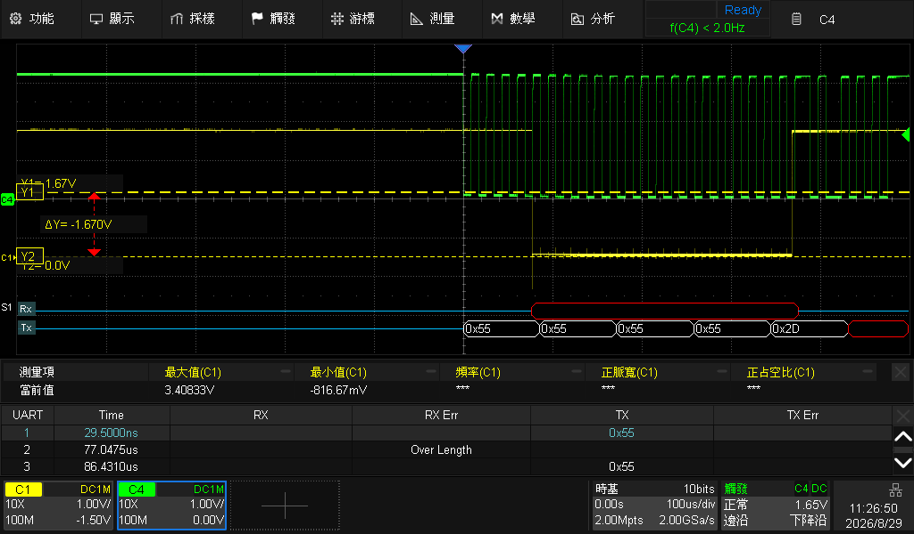

# 12 — core1 UART demo (two R8 cores, two jobs, one web page)

Division of labour, all over rpmsg, on one page (`http://<board-ip>:8080/`):

- **core0** drives hardware **PWM** (docs/07): knobs for frequency/duty,
  output on Pmod CN3 pin 9/10.
- **core1** drives a **UART terminal**: type text in the browser → rpmsg →
  core1 → **RSCI5 TX on P72 (Pmod CN6 pin 8)**, 115200 8N1. Whatever arrives
  on **RX P73 (CN3 pin 8)** streams back to the page.

```sh
sudo ~/r8web/start-pwm-demo.sh     # serves both panels
```

Wiring options:
- **Loopback**: jumper P72 (CN6-8) → P73 (CN3-8); typed text echoes straight
  back into the page's RX box.
- **Scope**: probe CN6-8. Set trigger source to that channel, falling edge
  ≈1.65 V, **Normal mode** (a message is a ~1.4 ms burst — Auto mode wipes it
  off the screen before you can look), ~100-200 µs/div. Typing a run of `U`
  characters shows a clean square wave at 57.6 kHz — half the bit rate, i.e.
  the baud rate made visible:



## Protocol (`r8_uart_proto.h`, ABI v1)

Same endpoint as the PWM protocol, dispatched by magic:

| Message | Fields | Meaning |
|---|---|---|
| `uart_cmd_t` (`UARC`) | op `SEND` + `data[len]` | transmit bytes |
| | op `QUERY` | drain the firmware's 1 KB RX ring |
| `uart_rsp_t` (`UARS`) | status, tx/rx/dropped totals, up to 384 B of RX | reply to either op |

The `uartd` resident client mode polls with QUERY every ~200 ms and mirrors
state into `/run/r8uart.json`; `send <text>` lines on its stdin become TX.
Try it without the web layer — **stop the web service first** (one client per
channel, docs/09 rule 3):

```sh
cd ~/r8_bench_c1
printf "send hello\n" | sudo R8_BENCH_NOTS=1 ./r8_bench_c1 uartd
cat /run/r8uart.json
```

## Firmware notes

The core1 UART firmware is the core1 base (docs/10 checklist) plus:

- FSP `sci_b_uart` module on channel 5 (RSCI5), 115200, callbacks at IPL 14.
  When adding a module to `configuration.xml` by hand, also add its
  `<stack module="…"/>` entry — without it the generator silently skips the
  module and the `g_uart_*` symbols never appear.
- Pins P72/P73 (`rsci5` pincfg). The DT already leaves RSCI5 to the R8
  (`serial@12802000` disabled), so no handover step is needed.
- `src/r8_uart_demo.c`: interrupt-driven RX into a ring buffer, non-blocking
  TX with a busy flag; the rpmsg callback handles `UARC` and never touches
  the UART from interrupt context beyond the ring.

## Troubleshooting

| Symptom | Cause | Fix |
|---|---|---|
| page sends, `tx_total` grows, but the scope shows nothing | trigger on the wrong channel, or Auto trigger mode | trigger on the probed channel, Normal mode, falling edge |
| scope shows a flat 0 V line | probe/ground contact | reseat the probe — idle must read 3.3 V |
| `tx_total` does not grow on web sends | `uartd` daemon not running | `sudo ~/r8web/start-pwm-demo.sh` (starts both daemons) |
| RX box stays empty | nothing wired to P73 | loopback jumper or a real serial source |
| direct `uartd` run times out | web service still holds the channel | stop it first, or use the web panel instead |
